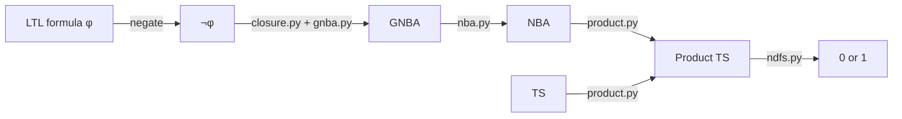
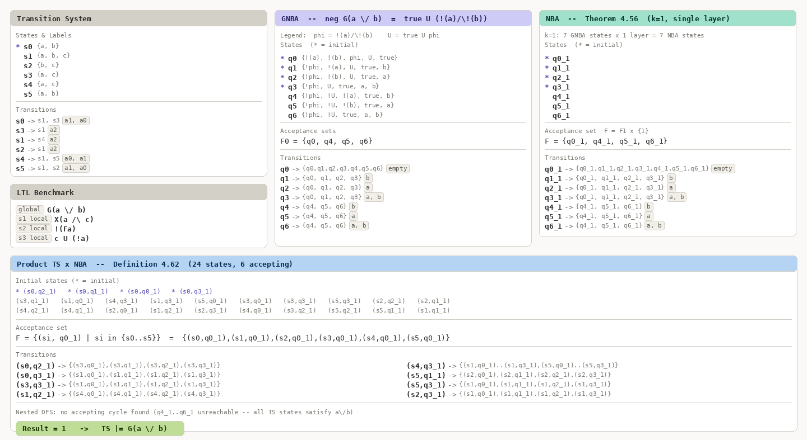

# LTL Model Checker


A Python implementation of LTL (Linear Temporal Logic) model checking, based on the automata-theoretic approach described in *Principles of Model Checking* by Baier & Katoen.

Given a transition system and a set of LTL formulas, the checker reports whether each formula holds. With `--verbose`, every intermediate automaton (GNBA, NBA, product TS) is printed for inspection.

## Pipeline



## Install

```bash
pip install -e ".[dev]"
```

## Usage

```bash
python -m src.run <folder> [--verbose]
```

`<folder>` must contain `TS.txt` and `benchmark.txt`.

| Flag | Description |
|------|-------------|
| `--verbose` | Print TS once, then GNBA → NBA → Product TS for each formula |

#### Examples

```bash
# Check all formulas in example_0
python -m src.run examples/example_0

# Check with full intermediate output
python -m src.run examples/example_0 --verbose

# Validate all 6 bundled examples against expected results
bash bash/check.sh

# Run all examples with verbose output
bash bash/verbose.sh
```

#### Output (quiet mode)

One line per formula: `1` if the TS satisfies the formula, `0` otherwise.

```
1
1
0
0
```

#### Output (verbose mode)

The TS is printed once at the top. Then for each formula, the full pipeline is shown:

```
[Transition System]
  AP: {a, b, c}
  States:
    * L(s0) = {a, b}
      L(s1) = {a, b, c}
      ...
  Transitions:
      s0 -> s1  [1]
      ...

[LTL Benchmark]
  Global formulas:
      G(a \/ b)
  Local formulas:
      s1: X(a /\ c)
      ...

[GNBA]
  AP: {a, b}
  States:
    * q0: {!(a), !(b), (true U (!(a) /\ !(b))), ...}
    ...
  Acceptance sets:
      F0 = {q0, q4, q5, q6}
  Transitions:
      q0 -> {q0, q1, q2, q3, q4, q5, q6}  [∅]
      ...

[NBA]
  AP: {a, b}
  States:
    * q0_1
    ...
  Acceptance set:
      F = {q0_1, q4_1, q5_1, q6_1}
  Transitions:
      q0_1 -> {q0_1, q1_1, q2_1, ...}  [∅]
      ...

[Product TS x NBA]
  States:
    * (s0, q2_1)
    ...
  Acceptance set:
      F = {(s0, q0_1), (s1, q0_1), ...}
  Transitions:
      (s0, q2_1) -> {(s3, q0_1), (s3, q1_1), ...}
      ...
1
```

The diagram below shows the complete pipeline for `example_0`, formula 1: `G(a \/ b)`.



Pre-generated verbose dumps for all 6 examples are in `output/`.

## Input Format

**TS.txt** — Transition system:

```
<S> <T>               # S states, T transitions
<initial states>      # space-separated state indices
<A>                   # number of actions
<P>                   # number of atomic propositions
<i> <k> <j>           # T lines: s_i -α_k-> s_j
...
<AP indices>          # S lines: label of s_i  (-1 for empty set)
...
```

**benchmark.txt** — Formulas to check:

```
<A> <B>               # A global formulas, B local formulas
<formula>             # A lines: checked from all TS initial states
...
<state> <formula>     # B lines: checked from the given state only
...
```

#### LTL Syntax

| Operator    | Symbol | Example    |
|-------------|--------|------------|
| Negation    | `!`    | `!a`       |
| Conjunction | `/\`   | `(a /\ b)` |
| Disjunction | `\/`   | `(a \/ b)` |
| Implication | `->`   | `(a -> b)` |
| Next        | `X`    | `X(a)`     |
| Globally    | `G`    | `G(a)`     |
| Finally     | `F`    | `F(a)`     |
| Until       | `U`    | `a U b`    |

Binary operators require brackets to eliminate ambiguity. Atomic propositions match `[a-z]+`.

## Data

Six bundled examples are provided under `examples/`:

| Directory | Formulas | Expected output |
|-----------|----------|-----------------|
| `example_0` | 1 global + 3 local | `1 1 0 0` |
| `example_1` | 0 global + 8 local | `1 1 1 1 1 1 1 1` |
| `example_2` | 0 global + 10 local | `1 0 0 0 1 1 0 1 1 1` |
| `example_3` | 3 global + 3 local | `1 0 1 1 0 1` |
| `example_4` | 1 global + 1 local | `0 0` |
| `example_5` | 1 global + 0 local | `0` |

Each directory contains:

```
examples/example_N/
├── TS.txt          # transition system
├── benchmark.txt   # LTL formulas
└── result.txt      # expected output (one line per formula)
```

Pre-generated verbose output for every example is in `output/`.

## Tests

```bash
pytest tests/
```

159 tests covering the parser, transition system loader, GNBA construction, and NBA conversion — all passing.

## Project Structure

```
ltl-model-checker/
├── src/
│   ├── run.py                    # entry point
│   ├── parser/                   # lexer, recursive descent parser, AST nodes
│   ├── ts/                       # transition system dataclass + file loader
│   ├── automata/
│   │   ├── closure.py            # formula rewriting, closure, elementary sets
│   │   ├── gnba.py               # LTL → GNBA  (Theorem 5.37)
│   │   ├── nba.py                # GNBA → NBA  (Theorem 4.56)
│   │   ├── product.py            # TS ⊗ NBA    (Definition 4.62)
│   │   └── ndfs.py               # Nested DFS  (Algorithm 8)
│   └── cli/
│       └── benchmark.py          # benchmark file parser
├── tests/                        # 159 unit tests
├── examples/                     # 6 example inputs + expected results
├── output/                       # pre-generated verbose dumps
├── assets/
│   └── example0_formula1.png     # pipeline diagram for G(a∨b)
├── bash/
│   ├── check.sh                  # validate all examples
│   └── verbose.sh                # run all examples with --verbose
└── pyproject.toml
```

## References

Baier, C. & Katoen, J.-P. (2008). *Principles of Model Checking*. MIT Press.
- Theorem 5.37 (p. 278): LTL formula to GNBA
- Theorem 4.56 (p. 195): GNBA to NBA
- Definition 4.62 (p. 200): Product of TS and NBA
- Algorithm 8 (p. 211): Nested DFS for persistence checking
